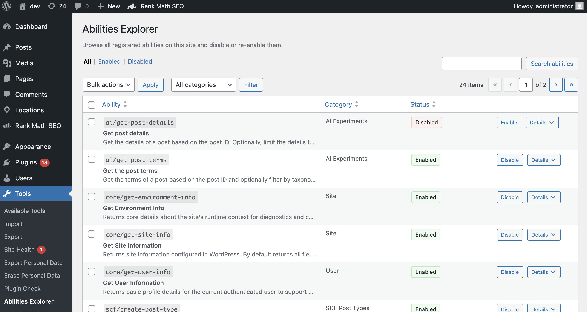

# WordPress Abilities API Inspector

Abilities Inspector is a WordPress admin plugin that lets you browse every registered Ability on your site and quickly disable or re-enable them. It is built for the WordPress Abilities API introduced in WP 6.9, and provides a fast, filterable list table with bulk actions plus a details panel for deeper inspection.

## Key Features

- **Browse all abilities** registered by WordPress core and plugins.
- **Enable/disable abilities** from a single screen.
- **Count of usage** showing how many times each ability is used across the site.
- **Bulk actions** for enabling or disabling multiple abilities at once.
- **Filters & search** by status, category, and free text.
- **Details panel** with metadata like description, category label, REST visibility, annotations, and input/output schemas (when available).

## Requirements

- **WordPress 6.9+** (or the Abilities API feature plugin).
- **PHP 7.4+**.
- Admin capability: `manage_options`.

## Installation

1. Upload the plugin folder to `wp-content/plugins/` or install the ZIP via **Plugins → Add New → Upload Plugin**.
2. Activate **Abilities Inspector**.
3. Go to **Tools → Abilities Inspector**.

## Usage

1. Open **Tools → Abilities Inspector** in wp-admin.
2. Use the status tabs (All / Enabled / Disabled) and the category filter to narrow results.
3. Search by ability name, label, description, or category.
4. Click **Disable** or **Enable** to toggle a single ability.
5. Use the bulk action dropdown to enable/disable multiple abilities at once.
6. Click **Details** to inspect an ability’s metadata.

## How Disabling Works

When an ability is disabled, the plugin intercepts its registration and:

- Sets `show_in_rest` to `false` (so it won’t be discoverable or executable via REST).
- Replaces the `execute_callback` with a 403 response.

Disabled abilities are stored in a WordPress option and applied on every registration, so the behavior persists across requests and admin sessions.

## Screenshots

1. **Abilities Inspector admin screen**

## Frequently Asked Questions

### What is an “Ability” in WordPress?
Abilities are part of WordPress’s Abilities API, which provides structured, discoverable capabilities that can be registered by core or plugins. This plugin simply lists and manages them.

### Why can’t I see any abilities?
Abilities are only available when the Abilities API is present. You need WordPress 6.9+ or the Abilities API feature plugin installed.

### Is disabling an ability permanent?
No. You can re-enable an ability at any time from the same admin screen. The plugin only stores the disabled list in a WordPress option.

### Does this affect custom or plugin-registered abilities?
Yes. Abilities Inspector lists and manages any ability registered through the Abilities API.

## Development Notes

- No build process is required; assets are loaded directly.
- Admin UI assets live in `assets/`.
- Core logic is in `includes/`.

## Changelog

### 0.2.0

- Added list table UI with filters, search, bulk actions, and a details panel.

## License

GPL v2 or later.
